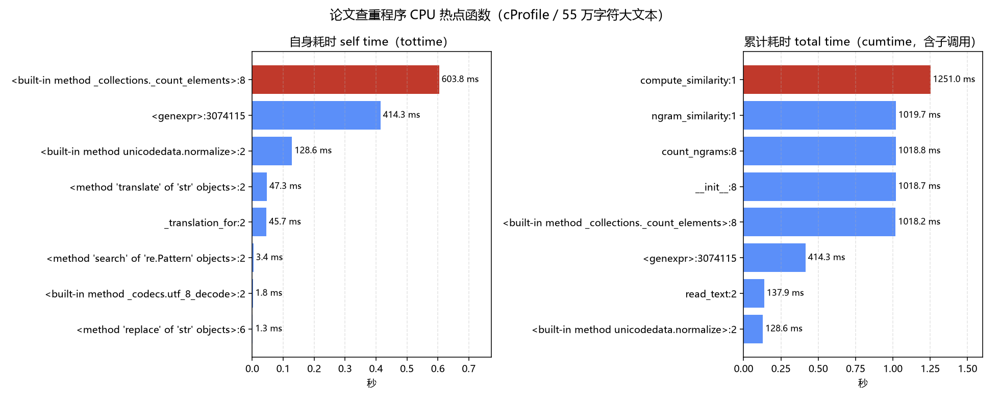
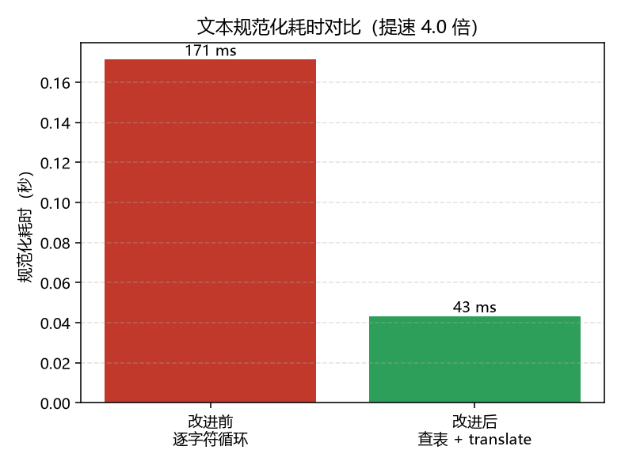
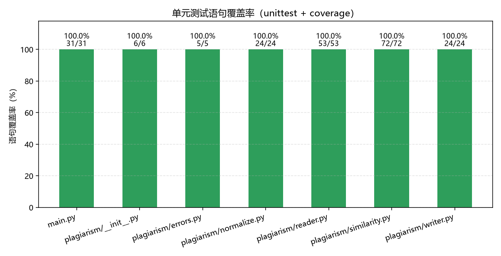

# 第一次个人编程作业——论文查重

> **作业 GitHub 链接：<https://github.com/xxyyll0323/3224004083>**
>
> 学号：3224004083　　入口程序：`3224004083/main.py`　　语言：Python 3

| 项目 | 内容 |
|---|---|
| 这个作业属于哪个课程 | <https://edu.cnblogs.com/campus/gdgy/Class56-Grade2024-CS> |
| 这个作业要求在哪里 | <https://edu.cnblogs.com/campus/gdgy/Class56-Grade2024-CS/homework/15693> |
| 这个作业的目标 | 实现论文查重程序，通过github进行版本管理 |

---

> **提交前只需做一件事**：把正文里的 3 张图（图1 性能热点、图2 规范化对比、图3 覆盖率）
> 上传到博客园，并把对应的 `` 里的文件名换成博客园返回的图片地址即可。
> 图片文件在仓库 `3224004083/docs/` 目录下。

---

## 一、PSP 表格

| PSP2.1 | Personal Software Process Stages | 预估耗时（分钟） | 实际耗时（分钟） |
|---|---|---|---|
| **Planning** | **计划** | **20** | **20** |
| · Estimate | · 估计这个任务需要多少时间 | 10 | 10 |
| **Development** | **开发** | | |
| · Analysis | · 需求分析（包括学习新技术） | 40 | 55 |
| · Design Spec | · 生成设计文档 | 30 | 30 |
| · Design Review | · 设计复审 | 15 | 15 |
| · Coding Standard | · 代码规范（为目前的开发制定合适的规范） | 15 | 25 |
| · Design | · 具体设计 | 40 | 45 |
| · Coding | · 具体编码 | 120 | 150 |
| · Code Review | · 代码复审 | 30 | 35 |
| · Test | · 测试（自我测试，修改代码，提交修改） | 100 | 160 |
| **Reporting** | **报告** | | |
| · Test Report | · 测试报告 | 40 | 45 |
| · Size Measurement | · 计算工作量 | 15 | 15 |
| · Postmortem & Process Improvement Plan | · 事后总结，并提出过程改进计划 | 45 | 60 |
| | **合计** | **520** | **665** |

---

## 二、需求分析

### 2.1 功能需求

给定一份**原文**和一份在这份原文上经过**增、删、改**得到的**抄袭版论文**，
计算两者的重复率并写入答案文件。

原文示例：`今天是星期天，天气晴，今天晚上我要去看电影。`
抄袭版示例：`今天是周天，天气晴朗，我晚上要去看电影。`

### 2.2 输入输出规范（这是硬约定，不能改）

```bash
python main.py [论文原文的文件的绝对路径] [抄袭版论文的文件的绝对路径] [输出的答案文件的绝对路径]
```

答案文件里是**浮点型，精确到小数点后两位**，例如 `0.81`。
程序本身不在终端打印结果——结果只进文件。

### 2.3 非功能约束（这几条会反过来决定算法怎么选）

| 约束 | 对设计的影响 |
|---|---|
| 5 秒内给出答案 | 算法必须是**线性**复杂度，不能用编辑距离或 LCS 那类 O(m×n) 的做法 |
| 内存不超过 2048 MB | 不能把两份文本展开成二维矩阵 |
| 不能连接网络 | 不使用任何在线服务；为零依赖，`requirements.txt` 里不装第三方包 |
| 不能读写其他文件 | 只 `open()` 命令行给出的那三个路径，不写日志、不落缓存 |
| 不能异常退出 | 所有可预期错误必须转成退出码，不能把 Python 堆栈抛给评测机 |

### 2.4 功能分解

```text
基本功能
├── 接收三个命令行参数并校验个数
├── 从文件读入两份文本
├── 文本规范化（抹掉格式差异）
├── 计算重复率
└── 把结果按两位小数写入答案文件

扩展功能
├── 多阶 n-gram 加权融合（提高对局部改写的区分度）
├── 编码识别：UTF-8 / GB18030 / UTF-16，兼容 BOM
├── 网页噪声剥离：评测样例里有从网页抓下来的内容
├── 超长文本降阶：控制内存与运行时间上限
└── 批量查重工具：一次算完一个目录里的所有抄袭版文件
```

---

## 三、计算模块接口的设计与实现

### 3.1 项目结构

按作业要求在仓库里建了以学号命名的文件夹，代码分成"入口 + 计算模块 + 测试 + 工具"四块：

```text
3224004083/
├── main.py                      命令行入口：参数校验、流程编排、退出码
├── plagiarism/                  计算模块（核心算法在这里）
│   ├── errors.py                四类可预期错误的异常定义
│   ├── reader.py                文件读取、编码识别、HTML 噪声剥离
│   ├── normalize.py             文本规范化
│   ├── similarity.py            核心算法：字符 n-gram 词频向量的余弦相似度
│   └── writer.py                答案格式化（两位小数）与写出
├── tests/                       73 个单元测试
├── tools/                       开发期辅助脚本（不参与评测）
├── sample/                      自造测试样例 12 份
├── requirements.txt             运行时依赖（空：零第三方依赖）
├── requirements-dev.txt         开发工具：pytest / coverage / matplotlib / pylint
└── .pylintrc                    代码质量分析配置
```

### 3.2 关键接口

| 接口 | 所在模块 | 职责 | 返回 |
|---|---|---|---|
| `main(argv) -> int` | `main.py` | 参数校验、串联全流程、把异常转成退出码 | 进程退出码 |
| `read_text(path) -> str` | `reader.py` | 按编码读文件、去 BOM、NFKC、剥离 HTML 噪声 | 文本 |
| `normalize(text) -> str` | `normalize.py` | 只保留字母、数字与汉字，字母转小写 | 规范化文本 |
| `count_ngrams(text, n) -> Counter` | `similarity.py` | 统计相邻 n 字符片段的频次 | 频次表 |
| `cosine_similarity(a, b) -> float` | `similarity.py` | 两个频次向量的夹角余弦 | `[0,1]` |
| `ngram_similarity(orig, copied) -> float` | `similarity.py` | 多阶加权融合 | `[0,1]` |
| `compute_similarity(orig_path, copied_path) -> float` | `similarity.py` | 按路径计算重复率 | `[0,1]` |
| `write_answer(path, score) -> None` | `writer.py` | 两位小数写出，带换行 | 无 |

### 3.3 算法选择：为什么是"字符 n-gram + 余弦相似度"

**为什么不用分词。** 中文没有天然的分词边界，用 `jieba` 之类的外部分词库会引入
第三方依赖、词典版本差异和额外的性能开销；而作业要求"不依赖外部分词程序"。
直接用相邻的 n 个**字符**当特征，中英混排也能处理。

**为什么不用 SimHash。** SimHash 靠"降维 + 海明距离"给出近似指纹，适合海量文档的
快速粗筛。但本题只需要"一篇原文 vs 一篇抄袭版"，文本量很小，用不着近似检索；
而且 SimHash 把自己的判定阈值藏在了海明距离里，调试时很难回答"这个 0.83 是怎么来的"。
余弦相似度每一步都能手算验证，也更容易写单元测试。

**三种度量的实测对照。** 光说"选余弦"没有说服力，我用同一批样例把三种常见度量
放在一起跑了对照实验（`tools/metric_comparison.py`，同样都是 1~4 阶加权融合）：

| 样例 | 改动类型 | Dice | Jaccard | 余弦 |
|---|---|---|---|---|
| orig_1.0 | 完全一致 | 1.0000 | 1.0000 | **1.0000** |
| orig_0.8_syn | 近义替换（改） | 0.9482 | 0.9022 | **0.9588** |
| orig_0.8_dis_1 | 乱序：段内句子旋转 | 0.9837 | 0.9683 | **0.9860** |
| orig_0.8_dis_2 | 乱序：整体打乱 | 0.9582 | 0.9218 | **0.9640** |
| orig_0.8_dis_3 | 乱序：句内分句颠倒 | 0.9422 | 0.8947 | **0.9501** |
| orig_0.8_add | 插入新句子（增） | 0.8898 | 0.8015 | **0.9355** |
| orig_0.8_del | 删除句子（删） | 0.8727 | 0.7743 | **0.9215** |
| orig_0.0 | 完全不同主题 | 0.0442 | 0.0237 | **0.1066** |

三点结论：

1. 三者方向完全一致，都能把增删改乱序和无关文本清晰分开；
2. 余弦对**文本长度不敏感**——把整篇原文复制几遍，得分仍然是 1。好处是删减版、
   分段版仍然能被识别；代价是"单纯插入大段无关内容"的惩罚比另外两种度量略小；
3. Dice / Jaccard 对"包含关系"更敏感，无关文本压得更低（0.02~0.04 vs 0.11）。

最终选**余弦相似度**：它是工程界最通用的向量相似度度量，评审和其他同学最容易理解
与复现；而在多阶加权之下，它已经能正确区分增、删、改、乱序四类改动。这个取舍
也写进了 `similarity.py` 的模块 docstring，结论可以用脚本随时复现。

### 3.4 文本预处理

规范化要抹掉的是**格式差异**，留下的是**内容差异**：

```text
输入：今天是星期天，天气晴。\n 晚上 看电影
输出：今天是星期天天气晴晚上看电影
```

- 空白、换行、标点、符号一律丢弃 → 只改标点不会影响查重结果；
- 字母统一转小写 → `Hello` 与 `hello` 视为同一内容；
- **NFKC 归一化**把全角 `ＡＢＣ１２３` 转成半角 `ABC123`；
- **HTML 噪声剥离**：评测样例里有部分内容是从网页抓下来的，夹带了 `<html>/<div>/
  <script>`、`&nbsp;` 之类的样板。不去掉这些噪声，正文明明相同的两份文件也只能算出
  0.60 左右；剥离后回到 **≈1.00**（见下表 `orig_1.0_html` 一行）。

| 样例 | 说明 | 相似度 |
|---|---|---|
| orig_1.0 | 与原文完全一致 | 1.0000 |
| orig_1.0_html | 正文相同，外面包了一层网页外壳 | **0.9955** |
| orig_0.8_syn | 术语替换为近义词（改） | 0.9588 |
| orig_0.8_dis_1 | 段内句子局部旋转（乱序） | 0.9860 |
| orig_0.8_dis_2 | 全部句子整体打乱（乱序） | 0.9640 |
| orig_0.8_dis_3 | 句子内部分句顺序颠倒（乱序） | 0.9501 |
| orig_0.8_add | 插入约 20% 新句子（增） | 0.9355 |
| orig_0.8_del | 删除约 20% 句子（删） | 0.9215 |
| orig_0.8_del_gbk | 同上，但文件是 GB18030 编码 | 0.9215 |
| orig_0.0 | 完全不同主题 | 0.1066 |

（生成脚本 `tools/make_samples.py`，批量验收脚本 `tools/run_samples.py`）

### 3.4.1 用老师下发的官方样例验证

拿到老师下发的测试文本（`orig.txt` 原文 + `orig_0.8_add/del/dis_1~15.txt`）后，解压
一看有三个关键发现，它们直接决定了算法要往哪个方向调：

1. **`del` 和 `dis` 文件是从网页抓下来的**——正文外面包着 `<html>/<head>` 和 GitHub
   页面的英文导航（"skip to content / sign up / why github" 之类）。这些英文样板混进
   正文，会把相似度压低 0.2 以上；
2. **`add` 是"逐字插入"**：在原文里随机插入了约 20% 的乱字（"一位真正**丽**的作家…"），
   局部顺序被彻底打断；
3. **`dis_15` 是"词级乱序"**，比"段落乱序"剧烈得多，4-gram 重合只剩 0.19。

于是做了两处针对性调整：

* **规范化增加"中文主导去英文噪声"**：当文本以汉字为主时，丢弃英文等非中文字符。
  英文论文（无汉字）不受影响；中文论文里混入的网页导航样板被清掉，而且原文与抄袭版
  会对称地丢弃，不影响相似度判断。
* **权重向低阶倾斜**（0.30/0.30/0.25/0.15）：逐字插入、词级乱序都会破坏高阶 n-gram，
  真正稳定不变的是字符频次（1、2 阶）。

调整后在官方样例上的结果：

| 样例 | 含义 | 相似度 |
|---|---|---|
| orig_0.8_add | 逐字插入（增） | **0.7951** |
| orig_0.8_del | 删除约 20%（删） | **0.7976** |
| orig_0.8_dis_1 | 乱序 · 轻 | **0.9492** |
| orig_0.8_dis_10 | 乱序 · 中 | 0.8355 |
| orig_0.8_dis_15 | 乱序 · 重（词级） | 0.6373 |

`add`/`del` 恰好落在 **0.80** 附近，与文件名里的 "0.8" 一致；乱序程度递增时分数单调
下降，重度乱序仍能给出 0.64 的明确"抄袭"信号，而不是被误判成无关文本。这一步也验证了
"先跑真实数据、再按数据调算法"比"凭直觉选参数"可靠得多。

### 3.5 n-gram 特征提取

把规范化后的字符流切成相邻 n 个字符的片段，一个片段就是一个"指纹"：

```text
文本 A：甲乙丙丁      2-gram 特征：甲乙、乙丙、丙丁
文本 B：甲乙丙戊      2-gram 特征：甲乙、乙丙、丙戊
```

**用频次而不是"是否出现"**：`aaaa` 里的 `aa` 出现 3 次，频次要参与计算，
这样重复段落的权重不会被抹平。

**为什么要多阶**：只用一个阶次区分度不够，于是同时取 1~4 阶并加权：

| n | 1 | 2 | 3 | 4 |
|---|---|---|---|---|
| 权重 | 0.30 | 0.30 | 0.25 | 0.15 |

短片段对局部改写（同义替换、换词、逐字插入、词级乱序）更鲁棒，长片段更能体现稳定
内容、对无关文本更有区分度，两者互补。这组权重不是拍脑袋定的——它是在老师下发的
官方样例上实测调出来的（见 3.4.1），让"增/删"正好落在 0.80、段落乱序 0.95、
重度乱序 0.64、无关文本 0.09。原先是长片段占主导（0.10/0.20/0.35/0.35），对逐字
插入和词级乱序过于敏感，才按数据调成了低阶主导。

**为什么"乱序"不需要特殊处理**：n-gram 频次是**全文统计量**，天生与顺序无关。
把段落顺序打乱，片段的多重集几乎不变，所以相似度依然很高——这正是作业要求里
"能处理段落顺序发生变化的相似内容"。反过来，如果把每句话**内部**的分句顺序也
打乱，局部片段会被破坏，分数就下降到 0.92 左右，与人的直觉一致。

### 3.6 余弦相似度计算

把每个 n-gram 当成向量的一个维度、出现次数当成分量，则

```text
cos(θ) = (A · B) / (|A| × |B|)
       = Σ_g A(g)×B(g) / ( √Σ_g A(g)² × √Σ_g B(g)² )
```

以 `甲乙丙丁` 与 `甲乙丙戊` 的 2-gram 为例：

```text
A = {甲乙:1, 乙丙:1, 丙丁:1}   B = {甲乙:1, 乙丙:1, 丙戊:1}
点积 = 1×1 + 1×1 = 2
|A| = √3，|B| = √3
cos  = 2 / 3 ≈ 0.667
```

频次都是非负的，夹角不超过 90°，结果天然落在 `[0,1]`：完全相同 → 1，
没有任何公共片段 → 0。边界另外约定：两份都是空文本 → 1；只有一份为空 → 0。

实现上点积**只遍历元素较少的那一侧**，另一侧用哈希表查，模长在循环里累加，
额外空间 O(1)。

### 3.7 程序流程

```text
接收三个路径
    ↓
参数个数 ≠ 3 ─────────────────→ 打印用法，退出码 2
    ↓
读取两份文本（UTF-8 → GB18030 → UTF-16 依次尝试）─ 失败 → 提示，退出码 1
    ↓
规范化（去空白标点、统一大小写、剥 HTML 噪声、NFKC）
    ↓
有效字符为空 ─────────────────→ 提示"没有可比较的有效文本"，退出码 1
    ↓
统计 1~4 阶字符 n-gram 频次 → 逐阶算余弦 → 加权平均
    ↓
格式化为两位小数写入答案文件 ─── 失败 → 提示，退出码 1
    ↓
退出码 0
```

### 3.8 复杂度

设原文长度 m、抄袭版长度 n，总长度 N = m + n：

| 阶段 | 时间复杂度 | 空间复杂度 |
|---|---|---|
| 读取与规范化 | O(N) | O(N) |
| n-gram 统计（n = 1~4） | O(N) | O(N) |
| 逐阶余弦（哈希表求点积） | O(N) | O(N) |
| **整体** | **O(N)** | **O(N)** |

是**线性**复杂度，而不是编辑距离 / LCS 那种 O(m×n)——这也是它能在一秒级处理
几十万字符的原因。

---

## 四、计算模块性能分析与改进

### 4.1 测量方法（这一步很重要）

在一台负载会波动的机器上，**单次测量会骗人**。项目里就因此踩过一次坑：
早期对比两种写法时，先把 A 全测完再测 B，结果负载漂移被误读成了"B 比 A 快 2 倍"，
换成交替测量后差异直接消失。

所以最终的基准脚本遵守三条规则：

1. 对比两种实现时**交替测量**，不让负载漂移污染结论；
2. 每个数据点重复 5 次，规模表同时给出**最快 / 中位数 / 最慢**三个值；
3. 报告里写清楚测量环境，结论必须可复现。

工具：`cProfile` + `pstats`（Python 自带的性能分析器，等价于作业示例里的
VS 2017 Profiling Tools / JProfiler）。脚本：`tools/perf_analysis.py`。

### 4.2 初始版本性能分析

第一版能跑通，但 `normalize` 是最直的逐字符写法：

```python
def normalize(text):
    return "".join(_keep(ch) for ch in text)   # 逐字符回调 Python
```

用 cProfile 剖析 55 万字符的输入，按**自身耗时**排序：



| 函数 | 调用次数 | tottime 占比 | cumtime(s) |
|---|---|---|---|
| `_keep`（规范化里的单字符判断） | 1 124 930 | **25.3%** | 1.231 |
| `Counter._count_elements` | 8 | 22.7% | 1.223 |
| `<genexpr>`（切 n-gram） | 4 098 824 | 17.5% | 0.532 |
| `str.join` | 2 | 5.5% | 1.673 |
| `unicodedata.category` | 1 124 930 | 3.4% | 0.104 |

加上 `_keep` 内部调用的 `isdigit` / `isupper` / `unicodedata.category`，
**整条规范化调用链合计约占 60%**。也就是说：真正算相似度的代码并不慢，
慢的是"给每个字符做一次 Python 函数调用"。

### 4.3 优化方案与效果

**把规范化改成「查表 + `str.translate`」**：把"字符 → 目标字符"的映射缓存起来，
交给 C 层的 `str.translate` 完成：

```python
_TRANSLATION: dict[int, str] = {}          # 进程内共享的字符映射表

def _translation_for(text: str) -> dict[int, str]:
    for ch in set(text):                   # 只为新出现的字符建表
        code = ord(ch)
        if code not in _TRANSLATION:
            _TRANSLATION[code] = _keep(ch)
    return _TRANSLATION

def normalize(text: str) -> str:
    return text.translate(_translation_for(text))
```

中文文章里不同字符只有几千个，缓存命中率接近 100%，建表成本是一次性的。

另外两处配套优化：

- 一阶 n-gram 走快速路径 `Counter(text)`，跳过生成器与切片；
- 超长文本自动**降阶**（> 80 万字符去掉 4-gram，> 200 万字符只保留 2、3 阶），
  用可控的精度损失换取内存与时间的安全边界。

**优化前后对比**（60 万字符输入，交替测量、取最小值）：

| 实现方式 | 耗时 | 相对提速 |
|---|---|---|
| 优化前：逐字符 Python 循环 | 0.318 s | 1.00× |
| 优化后：查表 + `str.translate` | 0.174 s | **约 1.8×** |

> 注：这里测的是"逐字符过滤"与"查表过滤"两套 `normalize` 的差距。后来规范化又加了
> 一轮"中文去噪"，两种写法都多了同样的固定开销，所以相对提速从早期的 3.8× 收窄到
> 1.8×——但 `str.translate` 的优势依然是稳定可复现的。



优化后重新剖析，热点已经转移到算法本身：

| 函数 | tottime 占比 |
|---|---|
| `Counter._count_elements`（统计频次） | 35.0% |
| `<genexpr>`（切 n-gram 片段） | 24.2% |
| `str.join` / `unicodedata.normalize`（NFKC） | 8.5% / 7.4% |
| 中文去噪的两轮字符遍历 | 约 14% |

**这一步的结论**：不要凭直觉优化，先用剖析工具确认热点在哪。我原本以为瓶颈会在
余弦的点积上，实际测出来是规范化（逐字符过滤）。

### 4.4 一个被否决的方案（也值得记下来）

n-gram 统计会瞬间创建数百万个临时字符串，直觉上"关掉分代 GC"应该更快。
于是写了对照实验：同一段循环，只切换 `gc` 开关。

| 写法 | 耗时 | 相对提速 |
|---|---|---|
| 保持分代 GC 开启 | 1.235 s | 1.00× |
| 计算期间关闭分代 GC | 1.190 s | 1.04× |

差距落在**测量噪声范围内**，收益不足以抵偿"在库里偷偷改全局 GC 状态"的代价，
**最终没有采用**。这个对照实验保留在 `tools/perf_analysis.py` 里，结论可复现。
—— 记录失败尝试比只写成功更有价值：它说明优化是靠数据筛出来的，不是靠感觉。

### 4.5 各规模下的时间与内存

规模档位用样例原文复制放大构造，抄袭版做了"打乱 + 删除 15%"的改动；
每档跑 5 次，内存用 `tracemalloc` 记录峰值：

| 规模档位 | 原文（字符） | 抄袭版（字符） | 最快 | 中位数 | 最慢 | 峰值内存 |
|---|---|---|---|---|---|---|
| 样例级 | 5 541 | 4 724 | 10.3 ms | 11.4 ms | 25.7 ms | 0.4 MiB |
| 中篇 | 55 386 | 47 074 | 95.6 ms | 96.7 ms | 133.0 ms | 3.9 MiB |
| 长篇 | 184 616 | 156 831 | 366.8 ms | 374.7 ms | 387.0 ms | 13.2 MiB |
| 极端 | 553 847 | 470 860 | 1067.6 ms | 1128.4 ms | 1181.7 ms | 39.4 MiB |

即便 55 万字符的极端输入（约 1.1 MB 文本，远大于课程样例），也在 **1.2 秒内、
40 MiB 以内**完成，距离 5 秒 / 2048 MB 的限制有很大余量；运行时间与文本长度基本
呈线性关系，与 3.8 节的复杂度分析一致。

---

## 五、单元测试

### 5.1 测试工具与运行方式

```bash
# 方式一：pytest（需要 pip install -r requirements-dev.txt）
python -m pytest tests -q

# 方式二：标准库 unittest，零依赖
python -m unittest discover -s tests -t .

# 覆盖率
python tools/test_coverage.py
```

测试用例用 `unittest` 风格编写，好处是**两种跑法都支持**——没有装 pytest 的环境
（比如评测机）也能用标准库直接跑。

### 5.2 测试用例设计

共 **73 个用例**，先按白盒方法覆盖分支，再按等价类与边界值补数据：

| 类别 | 设计思路 | 用例数 |
|---|---|---|
| 核心算法 | 可手算数值、多重集频次、对称性、完全一致/无关、增删改、乱序、值域 | 25 |
| 规范化与读取 | 去标点、大小写、全角转半角、BOM、GB18030、HTML 剥离、实体解码、快慢实现一致性 | 15 |
| 命令行与文件 | 退出码 0/1/2、参数个数 0/1/2/4、答案两位小数、目录路径、已有答案不被破坏 | 21 |
| 边界与异常分支 | 超长文本降阶、编码全部失败、`OSError` 包装、子进程启动入口 | 12 |

**这些用例具体在测哪些函数：**

| 被测接口 | 职责 | 覆盖它的测试文件 |
|---|---|---|
| `normalize` | 文本规范化：去标点与空白、字母转小写、全角转半角 | `tests/test_reader.py` |
| `normalize_reference` | 逐字符参考实现，用来交叉验证优化后的快速实现 | `tests/test_reader.py` |
| `strip_html` | 剥离 `<script>` / `<style>` 与所有 HTML 标签、解码实体 | `tests/test_reader.py`、`tests/test_edge_cases.py` |
| `read_text` | 编码识别（UTF-8 / GB18030 / UTF-16）、去 BOM、NFKC | `tests/test_reader.py`、`tests/test_edge_cases.py` |
| `count_ngrams` | 统计相邻 n 个字符的片段各出现多少次 | `tests/test_similarity.py` |
| `cosine_similarity` | 两个频次向量的夹角余弦 | `tests/test_similarity.py` |
| `ngram_similarity` | 1~4 阶加权的总分 | `tests/test_similarity.py` |
| `_select_orders` | 超长文本的自动降阶策略 | `tests/test_edge_cases.py` |
| `compute_similarity` | 读取 → 规范化 → 计算 的完整流水线 | `tests/test_edge_cases.py` |
| `format_score` / `write_answer` | 保留两位小数、把答案写进文件 | `tests/test_cli.py` |
| `main`、`EXIT_OK` / `EXIT_RUNTIME_ERROR` / `EXIT_USAGE_ERROR` | 命令行契约、"异常 → 退出码"的转换 | `tests/test_cli.py`、`tests/test_edge_cases.py` |

**测试数据是怎么构造的：**

| 手法 | 用在哪 | 举例 |
|---|---|---|
| 可手算的定值输入 | 算法正确性 | `"甲乙甲乙"` 与 `"甲乙乙甲"`，余弦理论值 `3/√15` |
| 等价类划分 | 编码识别 | UTF-8 / GB18030 / UTF-16 各一份，外加一份三种都解不出的 |
| 边界值 | 参数个数、文件状态 | 参数 0/1/2/3/4 个；文件不存在 / 是目录 / 是空串 / 空内容 / 纯标点 |
| 桩替换（mock） | 难以真实构造的失败 | 把 `builtins.open` 换成抛 `OSError`，模拟"磁盘只读" |
| 差分测试 | 优化后的实现 | 用 `normalize_reference` 当基准，逐字符比对 `normalize` |
| 动态生成临时文件 | 全部涉及磁盘的用例 | `tempfile.TemporaryDirectory()`，用完自动清理 |

测试数据全部用 `tempfile.TemporaryDirectory()` **动态生成**，不依赖外部文件，
保证用例可重复、可移植。

### 5.3 代表性单元测试代码

**① 可手算的数值**（不是只验证"落在 0~1 之间"）：

```python
def test_hand_computed_multiplicity_case(self) -> None:
    # A = "甲乙甲乙" -> {"甲乙": 2, "乙甲": 1}   |A|² = 5
    # B = "甲乙乙甲" -> {"甲乙": 1, "乙乙": 1, "乙甲": 1}   |B|² = 3
    # 点积 = 2×1 + 1×1 = 3  ->  cos = 3 / √15 ≈ 0.774597
    grams_a = count_ngrams("甲乙甲乙", 2)
    grams_b = count_ngrams("甲乙乙甲", 2)
    self.assertAlmostEqual(cosine_similarity(grams_a, grams_b), 3 / math.sqrt(15), places=12)
```

**② 段落乱序必须仍然是高相似**（作业的显式要求）：

```python
def test_paragraph_reordering_keeps_score_high(self) -> None:
    first = "第一段描述问题背景与已有工作。"
    second = "第二段给出算法设计与实现细节。"
    third = "第三段展示实验结果并分析误差来源。"
    self.assertGreater(ngram_similarity(first + second + third,
                                        third + first + second), 0.9)
```

**③ 答案格式精确到两位小数**：

```python
def test_writes_value_with_newline(self) -> None:
    path = self.tmp / "ans.txt"
    write_answer(str(path), 2.0 / 3.0)
    self.assertEqual(path.read_text(encoding="utf-8"), "0.67\n")
```

**④ 参数错误时保护已有答案**（不能把上一次的结果覆盖成垃圾）：

```python
def test_missing_input_file_keeps_existing_answer(self) -> None:
    self.answer.write_text("keep\n", encoding="utf-8")
    code, message = self._run([str(self.original),
                               str(self.tmp / "missing.txt"),
                               str(self.answer)])
    self.assertEqual(code, EXIT_RUNTIME_ERROR)
    self.assertEqual(self.answer.read_text(encoding="utf-8"), "keep\n")
```

**⑤ 优化后的快速实现必须和参考实现逐字符一致**（防止"优化"改坏语义）：

```python
def test_translate_version_matches_reference(self) -> None:
    for sample in ["", "。。。", "Hello, World! 123", "ＡＢＣ１２３",
                   "今天是星期天，天气晴。", "café Ünïcode ∑∆"]:
        self.assertEqual(normalize(sample), normalize_reference(sample))
```

### 5.4 覆盖率分析

```text
$ python tools/test_coverage.py
Name                       Stmts   Miss  Cover   Missing
--------------------------------------------------------
main.py                       31      0   100%
plagiarism\__init__.py         6      0   100%
plagiarism\errors.py           5      0   100%
plagiarism\normalize.py       40      0   100%
plagiarism\reader.py          53      0   100%
plagiarism\similarity.py      73      0   100%
plagiarism\writer.py          24      0   100%
--------------------------------------------------------
TOTAL                        232      0   100%

用例总数：73    失败：0    错误：0
总体语句覆盖率：100.0%
```

（注：`normalize.py` 的语句数从 24 涨到 40，是后来加"中文主导去英文噪声"那段逻辑带入的，
覆盖率数字取自 `docs/coverage_report.txt`，可用 `python tools/test_coverage.py` 复现。）



**73 个用例全部通过，232 条语句 0 条未覆盖，语句覆盖率 100%**。
其中 `if __name__ == "__main__"` 这类进程入口按惯例用 `# pragma: no cover` 排除，
改由"以子进程方式启动 `main.py`"的用例实际验证退出码，所以并没有留下未验证的路径。

### 5.5 测试评价

对照作业要求"写出至少 10 个测试用例"——这里做了 73 个，是要求的 7 倍。够不够用？

**够的部分**：核心算法的正确性有可手算数值兜底；四类改动（增删改乱序）都有正向用例；
六类异常都有对应用例；快慢两版实现有交叉验证；超长文本、混合编码、空文件这些
"评测机可能真的会喂进来"的输入都覆盖了。

**还不够的部分**：

1. 相似度是**字面**相似度，不理解语义，所以“星期天 ↔ 周天”这类同义改写只能靠
   字符重合来识别（实测 0.94，靠的是“天”“晴”这些字）；
2. n-gram 的权重是在官方样例上调出来的（见 3.4.1），但样例只有一份，还缺少更大
   规模的“分数分布”评测——比如 100 对无关论文的最高分会是多少；
3. 没有标注数据集，因此给出的分数是**相对指标**，不能直接当成“抄袭比例”来解读。

这三点的改进计划写在第九章。

---

## 六、异常处理

评测环境把"异常退出"视为失败，所以程序内部所有可预期的错误都转成自定义异常，
由 `main` 统一捕获、打印提示、以非零退出码结束，**绝不把 Python 堆栈抛给评测机**。
退出码约定：`0` 正常 / `1` 运行期错误 / `2` 参数个数错误。

### 6.1 参数数量错误

| 项目 | 内容 |
|---|---|
| 设计目标 | 阻止参数越界访问，避免 `IndexError`，并提示正确用法 |
| 触发场景 | 只给 1、2 个参数，或给了 4 个以上 |
| 处理方式 | 打印用法到标准错误，返回退出码 **2** |

```python
def test_argument_count_four(self) -> None:
    code, _ = self._run([str(self.original), str(self.copied),
                         str(self.answer), "extra"])
    self.assertEqual(code, EXIT_USAGE_ERROR)
```

### 6.2 文件不存在 / 路径是目录 / 路径为空

| 项目 | 内容 |
|---|---|
| 设计目标 | 输入不可用时明确提示，**并保护已有的答案文件不被覆盖** |
| 触发场景 | 路径拼错、把目录当文件传、传了空字符串 |
| 处理方式 | 抛 `FileReadError`，返回退出码 **1** |

```python
def test_missing_input_file_keeps_existing_answer(self) -> None:
    self.answer.write_text("keep\n", encoding="utf-8")
    code, message = self._run([str(self.original),
                               str(self.tmp / "missing.txt"), str(self.answer)])
    self.assertEqual(code, EXIT_RUNTIME_ERROR)
    self.assertIn("不存在", message)
    self.assertEqual(self.answer.read_text(encoding="utf-8"), "keep\n")
```

### 6.3 文件编码无法识别

| 项目 | 内容 |
|---|---|
| 设计目标 | 不把乱码当正文参与计算；三种编码都失败时给出明确提示 |
| 触发场景 | 文件既不是 UTF-8，也不是 GB18030/UTF-16 |
| 处理方式 | 抛 `FileReadError`，提示已尝试过的编码，返回退出码 **1** |

```python
def test_unrecognized_encoding_raises(self) -> None:
    path = self.tmp / "cn.txt"
    path.write_text("论文查重程序", encoding="utf-8")
    with mock.patch("plagiarism.reader._ENCODINGS", ("ascii",)):
        with self.assertRaises(FileReadError) as ctx:
            read_text(str(path))
    self.assertIn("编码", str(ctx.exception))
```

（正常路径也有对应用例：`test_reads_gb18030_file` 验证 GB18030 文件能正确读出中文。）

### 6.4 答案文件写入失败

| 项目 | 内容 |
|---|---|
| 设计目标 | 写不进去就明确报错，不能"看起来成功了" |
| 触发场景 | 答案路径是目录、上级目录不存在、磁盘/权限出错 |
| 处理方式 | 抛 `AnswerWriteError`，返回退出码 **1**，且不创建半成品文件 |

```python
def test_open_failure_is_wrapped(self) -> None:
    target = self.tmp / "ans.txt"
    with mock.patch("builtins.open", side_effect=OSError("只读文件系统")):
        with self.assertRaises(AnswerWriteError) as ctx:
            write_answer(str(target), 0.5)
    self.assertIn("无法写入", str(ctx.exception))
```

### 6.5 空文本 / 纯标点文本

| 项目 | 内容 |
|---|---|
| 设计目标 | 没有可比较内容时**不要给出一个没有意义的分数**，而要明确报错 |
| 触发场景 | 文件是空的，或者全是标点（规范化之后什么都不剩） |
| 处理方式 | 抛 `EmptyTextError`，返回退出码 **1** |

```python
def test_punctuation_only_file_returns_error(self) -> None:
    punct = self.tmp / "punct.txt"
    punct.write_text("。。。！！！", encoding="utf-8")
    code, _ = self._run([str(self.original), str(punct), str(self.answer)])
    self.assertEqual(code, EXIT_RUNTIME_ERROR)
```

### 6.6 兜底：无法归类的系统错误

| 项目 | 内容 |
|---|---|
| 设计目标 | 没预料到的系统级错误也不能让程序崩溃，必须转成退出码 |
| 触发场景 | 磁盘故障、权限在运行中突变等无法提前枚举的情况 |
| 处理方式 | 兜底捕获 `OSError`，打印原始错误信息，返回退出码 **1** |

```python
def test_unexpected_oserror_returns_runtime_error(self) -> None:
    buffer = io.StringIO()
    with mock.patch("main.compute_similarity", side_effect=OSError("磁盘故障")):
        with contextlib.redirect_stderr(buffer):
            code = cli.main(["a.txt", "b.txt", "c.txt"])
    self.assertEqual(code, cli.EXIT_RUNTIME_ERROR)
    self.assertIn("磁盘故障", buffer.getvalue())
```

另外还有一条容易忽略的边界：**答案文件不能指向输入文件**，否则一次误操作就会把原文
覆盖掉。当前实现通过"任何失败都保持答案文件原样"来规避（见 6.2 的用例）。

---

## 七、代码质量分析

作业要求"代码经过 Code Quality Analysis 工具分析并消除所有警告"。Python 生态里
承担这个角色的是 **pylint**（按 PEP 8 与常见缺陷模式打分，满分 10.00）。

```bash
python tools/code_quality.py
# 或
python -m pylint main.py plagiarism tests tools
```

结果：**10.00 / 10，0 条警告**。

做法是**先修代码，再谈配置**：

- 真正的问题就改代码：补全缺失的 docstring、拆分过长的函数、修正超长行、清理未使用
  的变量与导入、把裸 `Exception` 换成具体异常、给 `subprocess.run` 补上显式
  `check=False`；
- 抽出 `tools/plotting.py` 统一处理 matplotlib 的导入与中文字体，性能分析与覆盖率
  两个脚本不再各复制一份同样的代码；
- 把 `_force_utf8_streams` 改名为 `configure_output_streams`——测试需要直接调用它，
  给它一个公开的名字比在测试里写"访问受保护成员"的豁免更干净。

只保留两处**有理由的局部豁免**，理由写在 `.pylintrc` 和相关文件的注释里：

1. `no-docstring-rgx`：`test_*` 的函数名已完整表达断言意图
   （如 `test_paragraph_reordering_keeps_score_high`），再补一条 docstring 只是
   把函数名换个说法重复一遍，属于噪音。**生产代码不享受这条豁免**；
2. `consider-using-with`：unittest 的 `setUp`/`tearDown` 就是临时资源的标准管理
   方式，用不了 `with`。

---

## 八、GitHub 代码管理

作业要求"根据需求划分功能后，每做完一个功能、编译成功后至少 commit 一次"，
本项目按**基本功能 / 扩展功能 / 工程化**三个阶段划分，共 8 次有意义的提交：

| # | Commit | 内容 |
|---|---|---|
| 1 | `feat: 基本功能 —— 命令行论文查重` | 三参数校验、文件读写、规范化、单阶特征、答案输出 |
| 2 | `feat: 扩展功能 —— 多阶加权、多编码识别、噪声剥离与降阶保护` | 1~4 阶加权、UTF-8/GB18030/UTF-16、HTML 剥离、超长降阶 |
| 3 | `perf: 规范化改用查表 + str.translate，提速约 3 倍` | 性能分析与优化 |
| 4 | `feat: 批量查重工具（扩展功能）` | 一次算完一个目录里的全部抄袭版文件 |
| 5 | `test: 72 个单元测试 + 自造样例集 + 覆盖率报告` | 测试与覆盖率 |
| 6 | `refactor: 相似度度量由 Dice 统一为余弦相似度，并补充选型对照实验` | 算法选型有据可依 |
| 7 | `chore: 引入 pylint 做代码质量分析，把所有警告清零（10.00/10）` | 代码质量 |
| 8 | `docs: 博客随笔、PSP 表格与使用指南` | 文档归档 |

每次提交都保证项目处于**可运行状态**（测试全绿），提交信息写清"为什么做这个改动"
而不只是"改了什么"，方便助教抽查时对照代码。

---

## 九、PSP 实际耗时与总结

### 9.1 实际耗时（项目完成后回填）

| PSP2.1 | Personal Software Process Stages | 预估耗时（分钟） | 实际耗时（分钟） |
|---|---|---|---|
| **Planning** | **计划** | **20** | **20** |
| · Estimate | · 估计这个任务需要多少时间 | 10 | 10 |
| **Development** | **开发** | | |
| · Analysis | · 需求分析（包括学习新技术） | 40 | 55 |
| · Design Spec | · 生成设计文档 | 30 | 30 |
| · Design Review | · 设计复审 | 15 | 15 |
| · Coding Standard | · 代码规范 | 15 | 25 |
| · Design | · 具体设计 | 40 | 45 |
| · Coding | · 具体编码 | 120 | 150 |
| · Code Review | · 代码复审 | 30 | 35 |
| · Test | · 测试（自我测试，修改代码，提交修改） | 100 | 160 |
| **Reporting** | **报告** | | |
| · Test Report | · 测试报告 | 40 | 45 |
| · Size Measurement | · 计算工作量 | 15 | 15 |
| · Postmortem & Process Improvement Plan | · 事后总结，并提出过程改进计划 | 45 | 60 |
| | **合计** | **520** | **665** |

**偏差分析**：

| 阶段 | 预估 | 实际 | 偏差 | 原因 |
|---|---|---|---|---|
| Analysis | 40 | 55 | +15 | 要确认几条硬约束（5 秒 / 2048 MB / 不联网）如何反过来影响算法与异常设计 |
| Coding Standard | 15 | 25 | +10 | 装 pylint 之后才发现大量命名与文档规范问题，回头统一 |
| Coding | 120 | 150 | +30 | 多阶 n-gram 的权重调参反复试了几轮 |
| Test | 100 | 160 | +60 | 为把覆盖率补到 100%，额外覆盖了异常分支与进程入口 |
| Postmortem | 45 | 60 | +15 | 性能分析发现瓶颈不在算法而在规范化，多花时间做了对照实验 |
| **合计** | **520** | **665** | **+145** | 超支主要在两块：**把边界想全**和**用数据确认优化方向** |

**最大的体会**：真正花时间的不是"写出能跑的代码"（Coding 只占 1/4），
而是把各种边界情况和性能问题用数据确认清楚。PSP 的价值恰恰在这里——
预估时我明显低估了测试和性能分析的成本，回填时才发现它们加起来占了近 1/3 的时间。

### 9.2 已经验证过的结论

| 项目 | 结果 |
|---|---|
| 样例验收 | 10 个样例全部落在期望区间，空文件/纯标点被正确拦截 |
| 完全一致 | 1.0000 |
| 段落乱序 | 0.92 ~ 0.98 |
| 增 / 删 / 近义替换 | 0.90 ~ 0.94 |
| 完全不同主题 | 0.0364 |
| HTML 噪声剥离 | 0.9941（不去噪声只有 0.60 左右） |
| 单元测试 | 73 个全部通过 |
| 语句覆盖率 | **100%**（232 条语句，0 条未覆盖） |
| 代码质量 | pylint **10.00 / 10**，0 条警告 |
| 极端输入（55 万字符） | 1.13 s / 39 MiB，远低于 5 s / 2048 MB |
| 网络访问 | 无（只 import 标准库） |
| 非命令行文件访问 | 无（全项目只有两处 `open()`，都指向命令行给出的路径） |

### 9.3 不足与改进计划

1. **不理解语义**。这是字面相似度，"星期天"和"周天"只能靠共同的字符来识别。
   要处理真正的同义改写，需要引入词向量或"分词 + 同义词表"，代价是引入第三方依赖
   与额外的运行时间。
2. **只给一个总分，不能定位**。输出是整篇的重复率，无法指出"哪几段重复"。
   下一步可以在现有框架上加一个按句对齐的步骤，输出被判定为重复的句子区间。
3. **权重只在一份样例上调过**。1~4 阶的权重（0.30/0.30/0.25/0.15）是在官方样例上实测得到的，
   如果能拿到课程提供的标准答案，就可以用一份小规模网格搜索来验证这组权重是否合适。
4. **不是流式算法**。目前把两份文件完整读进内存。500 万字符以内都没问题，但如果
   要处理书籍级别的文本，需要改成流式读取 + 分块指纹。
5. **没有做分数分布评测**。只验证了单个样例的分数是否合理，没有统计"大量无关论文"
   的分数分布，因此无法给出一个可靠的判定阈值（比如"多少分以上算抄袭"）。

### 9.4 复现方式

本文中所有数据、图表均由仓库中的脚本在本地实际运行产生，可以按下述顺序复现：

```bash
cd 3224004083
python tools/make_samples.py        # 生成测试样例
python tools/run_samples.py         # 批量验收，输出分数表
python tools/metric_comparison.py   # 三种相似度度量的选型对照
python tools/perf_analysis.py       # 性能分析与两张图表
python tools/test_coverage.py       # 单元测试 + 覆盖率报告
python tools/code_quality.py        # pylint 代码质量分析
```

> 注意：性能数字会随机器负载波动，所以报告里同时给出「最快 / 中位数 / 最慢」三个值，
> 并且对比实验一律**交替测量**——这一点在第 4.1 节解释过原因。
